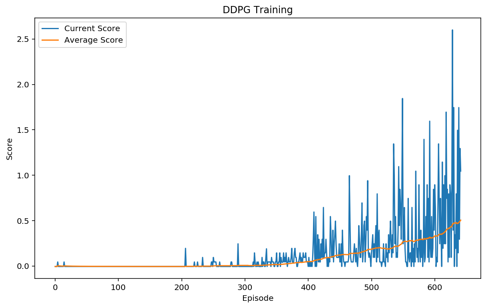
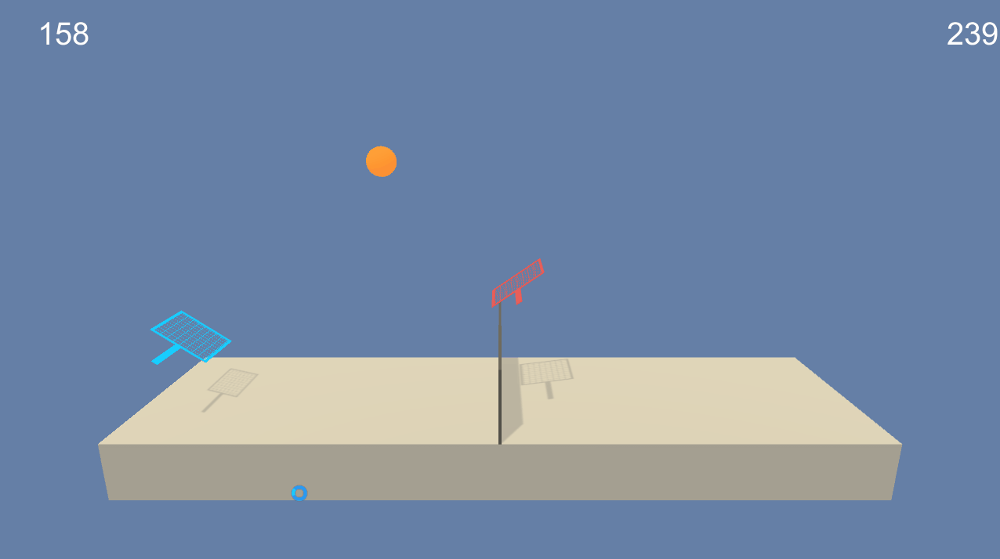

# DDPG for Collaboration and Competition

This project was completed using the a Deep Deterministic Policy Gradient (DDPG) algorithm.  This type of machine learning algorithm is usefuls for controlling systems with a continous action-space. Some key features of DDPG's are

  - they are deterministic
  - output is a single real value
  - continuous action space
  - off-policy for sample efficiency
  - model-free

# Implementation
The code is based on the DDPG bipedel demo from [Udacity](https://github.com/udacity/deep-reinforcement-learning/tree/master/ddpg-bipedal).

The key changes are as follows. In the model:

  * batch-normalization was performed in the actor and critic networks

In the Agent:
 - the following parameters were modified:
    * BUFFER_SIZE = int(1e5)  # replay buffer size
    * BATCH_SIZE = 512       # minibatch size
    * TAU = 1e-2              # for soft update of target parameters
    * WEIGHT_DECAY = 0.0000   # L2 weight decay
 - the learning code was moved to it's own function
     * this allowed learning to be called when needed
 - while running the agent, the learning updates were done 5 times every 10 steps
 - the maximum time steps was increased to 3000

The following bugs were removed from the ddpg_agent.py file:
 
 > 'torch.nn.utils.clip_grad_norm'

is deprecated, and changed to:
> 'torch.nn.utils.clip_grad_norm_'

The Ornstein-Uhlenbeck noise generator contained a bug that slowed (and sometimes reversed) learning:
>dx = self.theta * (self.mu - x) + self.sigma * np.array([random.random() for i in range(len(x))])

fixed with 
>dx = self.theta * (self.mu - x) + self.sigma * np.array([np.random.randn() for i in range(len(x))])

The error is dure to the use of the wrong random number generator.  The python random.random() returns a random float in the range [0.0, 1.0). The Numpy random.randn() return a random float sampled from a univariate “normal” (Gaussian) distribution of mean 0 and variance 1. The change allows negative numbers to be generated, and thus allows for the proper exploration noise to be generated.

# Results

I used a deque of the 100 last scores to determine when the program was finished. The algorithm required extensive tuning, and seems to perform better with more regular updates than the [previous project](https://github.com/dnhkng/RobotArm_DDPG/blob/master/README.md). The system was scoring over 0.5 points per episode after the 642nd episode. This is shown in the chart below.

The final model was run, and the rally of 9 passes was captured and is shown below:

# Future Work

This code used Action noise to help in exploration. It will be interesting to try using [Parameter Noise](https://blog.openai.com/better-exploration-with-parameter-noise/) to try to increase the learning rate, as this has been already demontrated. Also, expanding to Distributed Distributional Deterministic Policy Gradients ([D4PG](https://arxiv.org/abs/1804.08617)), would be interesting to test.